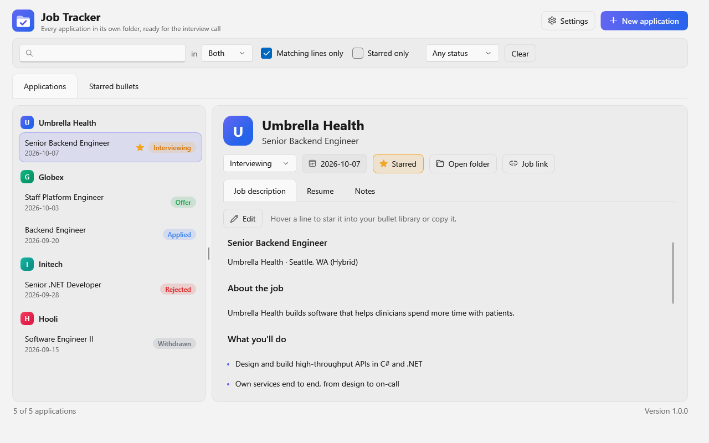
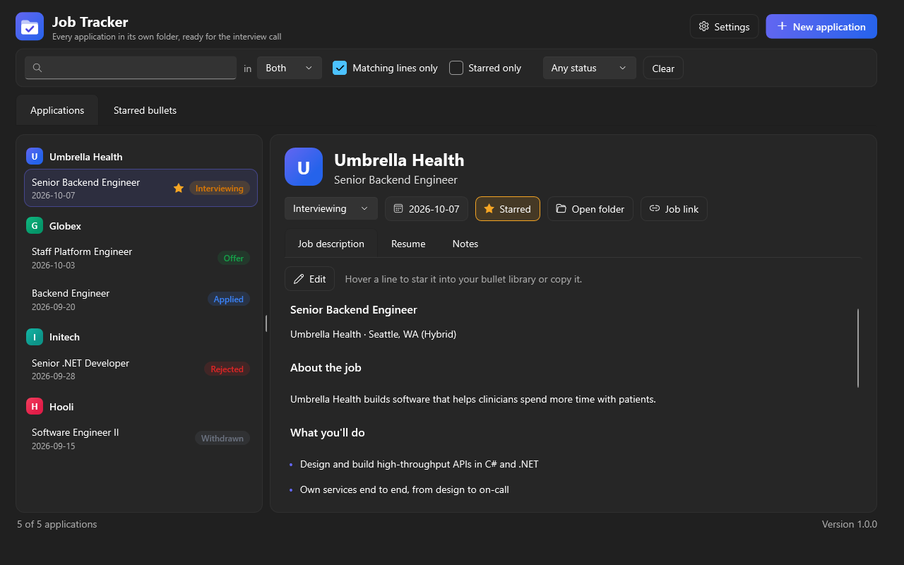
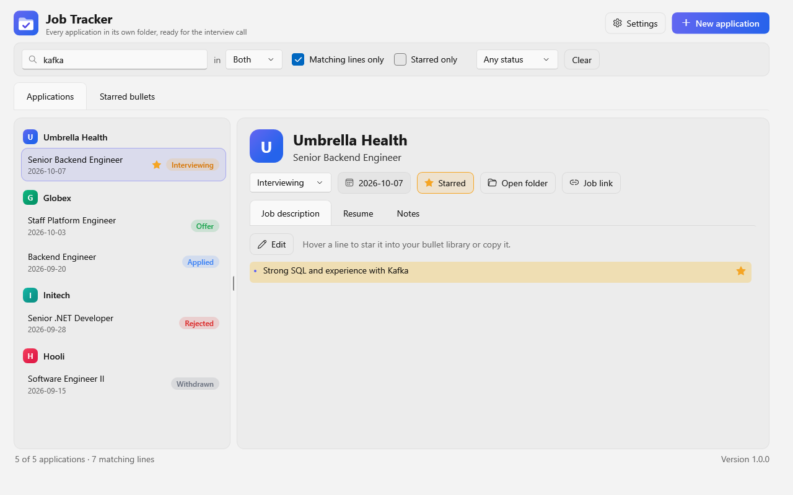
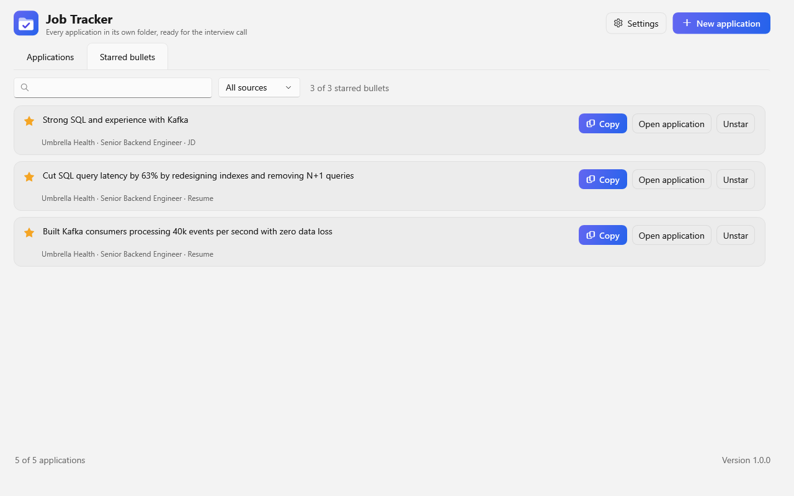
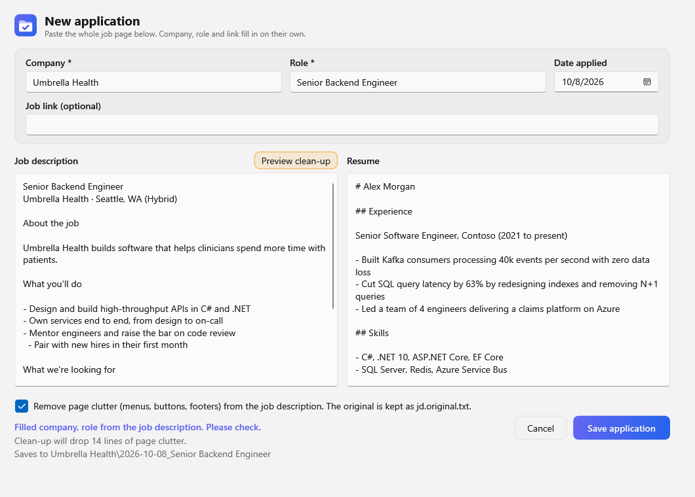

<p align="center">
  
</p>

<h1 align="center">Job Tracker</h1>

<p align="center">
  A Windows desktop app that keeps every job application in its own folder.<br>
  Paste the job page and your tailored resume: it saves both under the company and date, so you can find exactly what you sent when an interview is scheduled.
</p>

<p align="center">
  <a href="https://github.com/srinadhmanchikalapudi/job-tracker/releases/latest"><b>Download for Windows</b></a> &nbsp;·&nbsp;
  <a href="#install-in-3-steps">Install in 3 steps</a> &nbsp;·&nbsp;
  <a href="#using-the-app">Using the app</a> &nbsp;·&nbsp;
  <a href="#screenshots">Screenshots</a>
</p>

<p align="center">
  
  
  
  
  
  <a href="https://github.com/srinadhmanchikalapudi/job-tracker/releases/latest"></a>
  <a href="https://github.com/srinadhmanchikalapudi/job-tracker/actions/workflows/ci.yml"></a>
</p>

---

## Install in 3 steps

No technical knowledge needed. You need a Windows 10 or 11 PC.

1. **Download.** Open the [latest release](https://github.com/srinadhmanchikalapudi/job-tracker/releases/latest), scroll to **Assets** and click **`JobTracker-Setup-<version>.exe`**. It is about 57 MB.
2. **Run it.** Open the file from your Downloads folder.
   - If Windows shows a blue **"Windows protected your PC"** screen, that is expected (the app is not code-signed yet). Click **More info**, then **Run anyway**.
   - Click **Next** through the installer, then **Finish**. It installs just for you and asks for no administrator password.
3. **Open Job Tracker** from the Start menu and click **New application**.

It updates itself later: a bar appears at the top when a new version is out, and one click installs it. Your applications are never touched by an update or an uninstall.

---

## What it does

Applying to jobs means tailoring a resume for each posting. A week later, when a recruiter calls, you need that exact posting and that exact resume. Job Tracker keeps them together.

- **Paste, don't type.** Copy the whole job page (Ctrl+A, Ctrl+C) and paste it in. Company, role and link fill in on their own.
- **Clean job descriptions.** Menus, buttons, "Similar jobs" lists and cookie banners are removed. Headings, bullets and blank lines stay exactly as pasted. A preview shows the result first, and the original is kept as `jd.original.txt`.
- **One folder per application**, easy to find in Explorer: `JobApplications\<Company>\<date>_<Role>\`.
- **Search by keyword** inside job descriptions, resumes, or both. Every word must appear, and matching lines are highlighted.
- **Star the lines you want to reuse.** Hover any line to star it into your bullet library, or copy it (the leading dash is dropped). The **Starred bullets** tab is a searchable library of your best resume lines.
- **Track where each one stands:** Applied, Interviewing, Offer, Rejected or Withdrawn, with a notes tab for interview details.
- **Light and dark** to match Windows. Free, open source, and nothing leaves your computer except an optional once-a-day check for a new version.

## Screenshots

| | |
|---|---|
|  |  |
|  |  |



(The screenshots use invented sample data.)

## Using the app

| To do this | Do this |
|---|---|
| Add an application | **New application** (Ctrl+N). Paste the job page into the job description box, paste your resume, check the filled-in company and role, and click **Save application**. |
| See the cleaned description before saving | **Preview clean-up** above the job description box. Untick the clean-up checkbox to keep the paste exactly as it is. |
| Find an application | **Search** (Ctrl+F). Choose **JD**, **Resume** or **Both**, tick **Matching lines only** to hide everything else, and filter by status or starred. |
| Keep a resume line for later | Hover the line and click the star. It appears under **Starred bullets** with its company and role. |
| Copy a line into a new resume | Click the copy icon on the line, or **Copy** in Starred bullets. |
| Open the folder in Explorer | **Open folder** on the application. |
| Change where applications are saved | **Settings**, **Change…** (default: `Desktop\JobApplications`). |

## Where your files go

```
JobApplications\
  Acme Corp\
    2026-10-07_Senior Backend Engineer\
      jd.md  resume.md  notes.md  meta.json
      jd.original.txt                  # the JD exactly as pasted, only when clean-up changed it
  .jobtracker\bullets.json             # your starred bullets
```

These are plain text files. You can open and edit them in any editor, and the app picks the changes up. The folder is yours: uninstalling Job Tracker never deletes it. The app's own small settings file is in `%APPDATA%\JobTracker\settings.json`.

## Updates and privacy

- The app does not collect or send anything. The only network request is the optional update check: one call to GitHub's public releases API, at most once a day, which you can turn off in **Settings**.
- An update is downloaded from this repository's releases over HTTPS, checked against the SHA-256 checksum GitHub publishes for it, and only started after you click **Update now**.
- Not code-signed yet, so Windows SmartScreen may warn the first time.

## Development

Requires the .NET 10 SDK on Windows.

```bash
dotnet run --project src/JobTracker.App
dotnet build JobTracker.slnx -c Release     # use -c Release while the app is running (a running Debug app locks its DLLs)
dotnet test                                 # all tests
```

- `src/JobTracker.Core`: no UI. Folder naming, storage, job-page extraction and clean-up, search (`ISearchProvider`), the bullet library, and the update code.
- `src/JobTracker.App`: the WPF shell (MVVM with CommunityToolkit.Mvvm). Colours come from the Fluent theme, so light and dark follow Windows.
- `src/JobTracker.App/Assets/Logo.xaml` is the vector logo; `app.ico` and `logo.png` are rendered from it.
- Environment variables for development: `JOBTRACKER_DATA_ROOT=<folder>` points the app at another data folder without changing your saved setting; `JOBTRACKER_NO_UPDATE_CHECK=1` skips the update check.
- Search is plain keyword matching. `ISearchProvider` is the seam for a local semantic (embedding) search later.

## Releasing

Releases are built by GitHub Actions, as in the author's other project, [Interview Coach](https://github.com/srinadhmanchikalapudi/interview-coach).

1. Make sure `main` is green in CI and everything is committed.
2. Tag and push: `git tag -a v1.0.1 -m "Summary"` then `git push origin v1.0.1`.
3. The **Release** workflow tests the code, builds the single-file exe, a zip and the Inno Setup installer, and publishes them with notes made from the commit subjects since the previous tag.

To build the installer locally: `winget install JRSoftware.InnoSetup`, then `powershell -ExecutionPolicy Bypass -File tools\publish.ps1 -Version 1.0.0 -Installer`. The output is in `dist\`.

Never change the `AppId` in `installer\JobTracker.iss` (nor `InstallationInfo.UninstallKey`, which is derived from it): Windows uses it to upgrade the old version instead of installing beside it.

## Commit conventions

The commits go straight to `main` and **the subjects are the release notes**, so write each one for a user: imperative, about 60 characters, prefixed with the area (`app:`, `core:`, `installer:`, `docs:`), with a body saying what and why.

## License

[MIT](LICENSE). Third-party packages are listed in [THIRD-PARTY-NOTICES.md](THIRD-PARTY-NOTICES.md).
